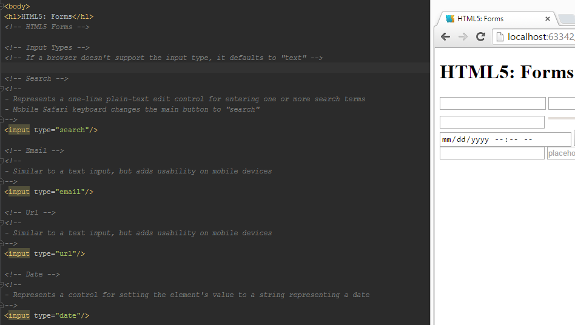

<a name="README"></a>


# HTML5/CSS3: Advanced Topics

Use this tutorial as a guide to learn HTML5 and CSS3. Each unit contains an annotated lesson that can assist you in developing your Web Development skills.

Topics
================
- HTML5 Overview
- HTML5 Elements
- HTML5 Forms
- CSS3 Fonts
- CSS3 Styles
- The Document Outline
- CSS3 Animations
- Transform: Translate
- Transform: Rotate
- Transform: Scale
- Transform: Skew
- Transition

Suggested prerequisites
====================
<a name="README">[](https://github.com/MartinChavez/HTML-CSS)</a>

HTML5 Overview
====================
```HTML
<!-- HTML5 -->
<!-- HTML5 is the definition used to refer to the latest version of HTML -->
<!--
 Features:
* New HTML elements and attributes
* CSS3 support
* Video and audio elements
* 2D and 3D graphics
* Local storage
* Local SQL database
-->

<!-- In HTML5, there is only one simple DOCTYPE, it has the following syntax -->
<!DOCTYPE html>

<html lang="en">
<head>
    <!-- In HTML5, you can specify the encoding by simply adding the charset attribute -->
    <meta charset="UTF-8">

    <!-- You don't need to specify the type attribute anymore (for <script> and <link>) -->
    <!-- A modern browser will infer that the file is javascript or css  -->
    <script src=""></script>
    <link rel="stylesheet" href="css/overview.css"/>

    <title>HTML/CSS: Overview</title>
</head>
<body>
<h1>HTML5: Overview</h1>

<h1>Tag Updates</h1>
<!-- Tag Updates -->
<!-- <i> tag represents text in a different "tone", like a thought -->
<p>This <i>text</i> has the i tag </p>
<!-- <b> tag represents stylistically offset text  -->
<p>This <b>text</b> has the b tag </p>
<!-- <em> tag represents "stress" emphasis -->
<p>This <em>text</em> has the em tag </p>
<!-- <strong> tag represents strong importance -->
<p>This <strong>text</strong> has the strong tag </p>
```
HTML5 Elements
====================
```HTML
<!-- HTML5 Elements -->

<!-- Section -->
<!-- Represents a generic document or application section -->

<!-- Section vs Div -->
<!--
- Div elements have no semantic meaning whereas Section elements do
- Section is used for grouping together thematically related content
-->
<section>
    <h2>Section Tag</h2>
</section>

<!-- The Document Outline -->
<!-- It produces an outline summary of an HTML document based on its markup -->

<!-- The following elements have their own self-contained outline -->
<!--
- Article
- Aside
- Nav
- Section
-->

<!-- For example: -->
<h1>Tile
<section>
    <h2>Sub Title</h2>
</section>
</h1>
<!--
 Will produce the following output:
 1. Title
    1.1 Subtitle
 -->

<!-- Header -->
<!-- A group of introductory or navigational aids -->
<!--
 - There can be many different headers on a page
 - Generally, it appears at the top of a document or section, but it is defined by its content rather than its position
 -->
<header>
    Header
</header>

<!-- Footer -->
<!-- The footer element represents a footer for its nearest ancestor sectioning content or sectioning root element -->
<!--
- The footer element is not position-dependent
- The footer describes the content it is contained within
-->
<footer>
    Footer
</footer>

<!-- Aside -->
<!--
- Tangentially related to the content surrounding it
- When used within an article element, the aside contents should be related to that particular article
  it is contained within
- When used outside an article element, the aside contents should be specifically related to the site (sidebar)
- It represents content that is not the primary focus of an article or page,
  but it is still related to the article or page
-->
<aside>
    Aside
</aside>
<!-- Nav -->
<!--
- The nav element represents a section of a page that links to other pages or to parts within the page:
  a section with navigation links
- The nav element is intended for major navigation
-->
<nav>
    <ul>
        Nav
    </ul>
</nav>
<!-- Article -->
<!--
- The article element represents a complete, or self-contained, composition in a document, page, application, or site
  and that is, in principle, independently distributable or reusable
- The article element is another type of section. It is used for self-contained related content
-->
<article>
    Article
</article>
<!-- Main -->
<!--
- Represents the main content of the body of a document or application
- The main content area consists of content that is directly related to or expands upon the central topic of a document
  or central functionality of an application.
Warnings
- Do not include more than one main element in a document
- Do not include the main element inside of an article, aside, footer, header, or nav element
 -->
<main>
    Main
</main>
<!-- Figure -->
<!--
- The figure element represents a unit of content, optionally with a caption, that is self-contained
- If removed, it doesn't affect the document's meaning
-->
<!-- Figcaption -->
<!--
- Represents a caption or legend for a figure
-->
<figure>
    
    <figcaption>Fig caption</figcaption>
</figure>
<!-- Time -->
<!--
- Represents a time on a 24 hour clock or a precise date in the gregorian calendar
-->
<time>2015-19-15</time>
<!-- Use the datetime attribute to get our desired format -->
<time datetime="2015-19-16">2015/19/15</time>
```
CSS3 Styles
====================
```CSS
/* CSS3: Styles */

.border-radius{
    background: grey;
    height: 50px;
    width: 200px;
}

/* Border Radius */
/*
- This property applies rounded corners to borders
- To achieve this, you can specify 4 different properties which represent each corner
*/

.border-radius{
    border-top-left-radius: 15px;
    border-top-right-radius: 15px;
    border-bottom-left-radius: 15px;
    border-bottom-right-radius: 15px;
}

/* You can use the shorthand version to specify all sides at once */
.border-radius {
    border-radius: 15px;
}
/* You can specify each border-radius value individually */
.border-radius {
    border-radius: 15px 15px 15px 15px;
    /* top-left top-right bottom-right bottom-left */
}

/* You can also specify the border-radius value in percentages */
.border-radius {
    border-radius: 8%;
}

/* Box Shadow */
/*
- This property specifies a shadow on an element
*/
.box-shadow{
    box-shadow: 1px 2px 2px #000;
    /* Box shadow properties
    - Inset: If it is not specified(which is the default), a drop shadow is created, rather than an inset shadow
    - Offset-x: Move the shadow along the x-axis
    - Offset-y: Move the shadow along the y-axis
    - Blur-radius: Alters the blur amount of the shadow, causing it to become bigger and lighter
    - Spread-radius: Causes the shadow to expand or shrink
    - Color: Color of the shadow
    */

    /* If you want to specify the spread-radius instead of blur-radius, you need to add a 0 */
    box-shadow: 1px 2px 0 2px #000;
}

/* You can specify multiple box-shadows via a comma-separated list */
.box-shadow{
    box-shadow: 1px 2px 2px #000,
    inset 1px 1px 2px blue;
}
/* You can also specify negative values on the box-shadow */
.box-shadow{
    box-shadow: -1px -2px 2px #000;
}

/* Text Shadow */
/*
- This property is very similar to box-shadow, but it applies the shadow to text
*/
.text-shadow{
    text-shadow: 1px 2px 2px #000;
    /* Text shadow properties
    - Offset-x: Move the shadow along the x-axis
    - Offset-y: Move the shadow along the y-axis
    - Blur-radius: Alters the blur amount of the shadow, causing it to become bigger and lighter
    - Color: Color of the shadow
    */
}

/* Box sizing */
/*
- This property is used to change the default CSS box model,
  which is used to calculate widths and heights of given elements
*/
/*
- Note: The Box Model is covered in HTML/CSS: Basics course
*/
.box-sizing{
    border: 2px solid black;
    margin: 20px;
    padding: 10px;
    width: 300px; /* Represents the contents of the box */
}

/* Content-box */
/*
- This is the default value. The width and height are measured by including only the content,
  but not the border, margin, or padding.
*/
/* Padding-box */
/*
- The width and height include the padding, but do not include the border or margin
*/
.box-sizing{
    /* The padding has been included in the width (content) area,so they are treated as one region*/
    box-sizing: padding-box;
    border: 2px solid black;
    margin: 20px;
    padding: 10px;
    width: 300px; /* Represents the contents of the box */
}
/* Border-box */
/*
- The width and height include the padding and border, but do not include the margin
*/
.box-sizing{
    /* The padding and the border has been included in the width(content) area, so they are treated as one region*/
    box-sizing: border-box;
    border: 2px solid black;
    margin: 20px;
    padding: 10px;
    width: 300px; /* Represents the contents of the box */
}

/* Multiple backgrounds */
/*
- CSS3 allows you to apply multiple backgrounds to an element.
- The multiple backgrounds are stacked in the order in which you specify them
- You can then specify the background position for each element
*/
.multiple-backgrounds {
    background-image: url(../img/js.jpg), url(../img/html.jpg);
    background-position: top left, center right;
    background-repeat: no-repeat, no-repeat;
}

/* These properties can be specified in one line as well */
.multiple-backgrounds {
    background: url(../img/js.jpg), url(../img/html.jpg) no-repeat, no-repeat top left, center right;
}
/* Color */
/*
- CSS3 provides multiple ways to work with color
  * RGBa:
    - Represents the three additive primary colors, red, green, and blue.
    - In CSS3, we can also pass the alpha value (the "a" in RGBa) which represents the opacity of a color
  * HSLa:
    - Stands for Hue, Saturation and Lightness
    - You can specify the alpha value for the opacity of the color
*/
.RGBa{
    color: rgba(0,0,0,0.75); /* We are specifying a 75% opaque black color value */
}
.HSLa{
    color: hsla(240,100% ,50%,0.75);
    /* The parameters have the following order:
     - Hue
     - Saturation
     - Lightness
     - Alpha value
     */
}

/* HSLa vs RGBa */
/*
- HSLa is more intuitive than RGBa, and it's much easier to make color adjustments fast
*/

/* Opacity */
/*
- Allows you to specify the opacity of an element using the opacity property
- Opacity on an element affects all elements that are nested inside
*/
.opacity{
    /* Represents a 45% opaque color value */
    opacity: 0.45;
}

/* Gradients */
/*
- Smooth transitions between two or more colors
*/

/* Linear Gradients */
/*
- We need to specify the stating point, then ending point, and optional stop-color points.
*/
.linear-gradient{
    /* The parameters are the following:
      - Direction: This can be specified through an angle or a keyword
      - The angle is generally a degree (34deg)
      - The side-or-corner consists of two keywords (left or right) and (top or bottom)
    - Color Stops: Consists of a color and optional stop position, which can be either a percentage or length
    */
    background: linear-gradient(to bottom, red, yellow);
}

/* Radial Gradients */
/*
- Unlike a linear gradient, creates a gradient that extends from an origin, the center of the element, extending
  outward in a circular or elliptical shape
- Consists of three parts: center, the ending shape contour and position, and color stops
*/
.radial-gradient{
    /* Creates a two-color elliptical gradient that radiates from the center by default */
    background: radial-gradient(aqua,blue);
    /*
    Parameters (in order):
    - The shape of the gradient;circle or ellipsis. The default is ellipsis.
    - The size of the gradient, which consist of keywords
      (closest-side, closest-corner, farthest-side and farthest-corner*). *default
    - Position (same as background-position). Default is center
    - Color stops
    */
    background: radial-gradient(circle at top left, aqua, blue);
}

```
CSS3 Animations
====================
```CSS
/* CSS3: Animations */

/* Transforms */
/*
- This property allows you to translate, rotate, scale, and skew elements in CSS
*/

/* Translate */
/*
- The translate() method moves an element from its current position
  (according to the parameters given for the X-axis and the Y-axis).
*/
.transform{
    /* Translate the element 20px to the right */
    /* Translate the element 30px down */
    transform: translate(20px, 30px);
    /* Translate parameters*/
    /*
    - A translation value for the x-axis, which can be either a length or a percentage
    - A translation value for the y-axis, which can be either a length or  a percentage, if not specified,the value is 0
    */
}
/* It is possible to use translateX and translateY to translate the x and y values individually */
.transform {
    transform: translateX(30px);
}
.transform {
    transform: translateY(40px);
}

/* Rotate */
/*
-  It is possible to rotate an element clockwise around its origin by the specified angle
*/
.rotate {
    transform: rotate(45deg);
}

/* Scale */
/*
- You can do a 2D scale by a specified unitless number
*/
.scale {
    /* The element is scaled to the unitless number: 4 */
    /* If you don't specify a value for y-axis, it defaults to the value of x-axis */
    transform: scale(4, 1);
}

/* Skew */
/*
- An element is skewed around the x or y axis by the angle specified
- You can use skewX and skewY that use an angle as its parameters
*/
.skew{
    transform: skewX(-25deg);
    transform: skewY(25deg);
}

/* Transitions */
/*
- Allow you to transition between two states of a specified element
*/
.transition{
    /* Parameters (in order):
    - Property: The CSS property you want to transition
    - Duration: The amount of time you want the transition to take place
    - Timing function: Timing of the transition itself (ease, ease-in, ease-in-out, linear, etc)
    - Delay: The amount of time to wait between the change that is being requested on a specific property,
      and the start of the transition
    */
    /* The background-color transitions from grey to crimson over the period of .5s*/
    transition: background-color 0.5s ease-in-out;
}
.transition:hover{
    background-color: crimson;
}

.transition:hover{
    color: navajowhite;
}
/* Using 'all' as the transition-property, we can transition multiple properties at once */
.transition{
    transition: all 0.5s ease-in-out;
}

/* Progressive Enhancement */
/*
- Refers to the use of newer features that add to the experience in modern browsers that support those features,
  but doesn't detract from the experience in older browsers.
*/
.progressive-enhancement{
    background: #ccc;
    /* If the border-radius and box-shadow properties aren't supported, we still get a usable experience */
    border-radius: 10px;
    box-shadow: 0 1px 1px rgba(0,0,0,0.75);
}
```
CSS3 Fonts
====================
```CSS
/* CSS3: Fonts */

/* Font Face */
/*
- Using @font-face, you can use online fonts on websites.
*/

@font-face {
    font-family: 'OpenSansRegular'; /* Name that is assigned to this font */
    /* It is possible to specify multiple font types, which can be added as additional urls() */
    src: url('../fonts/OpenSans-Regular-webfont.eot');
    font-style: normal;
    font-weight: normal;
}

h1 {
    /* You need to specify the font-family as the same one established in the @font-face call */
    /* It is a good practice to provide fallback fonts*/
    font-family: 'OpenSansRegular', Helvetica;
}

/* You can alter the @font-face call in order to use the font-weight and font-style properties as usual */
@font-face {
    font-family: 'OpenSansRegular';
    src: url('../fonts/OpenSans-Regular-webfont.eot');
    font-style: normal;
    font-weight: bold;
}

h1 {
    /* Then you can use the bold version by changing the font-weight instead of the font-family */
    font-weight: bold;
}
```

Run and Play
====================
All the html files are linked to their respective CSS files. Open your browser and start learning!



## Author

**[Martin Chavez](https://github.com/MartinChavez)**

Continue Learning
====================
<a name="README">[](https://github.com/MartinChavez/Learn-Javascript)</a>
<a name="README">[](https://github.com/MartinChavez/Node.js-Tutorial)</a>
<a name="README">[](https://github.com/MartinChavez/AngularJs-Basics)</a>
<a name="README">[](https://github.com/MartinChavez/AngularJS-Advanced-Topics)</a>
<a name="README">[](https://github.com/MartinChavez/CSharp)</a>
<a name="README">[](https://github.com/MartinChavez/LINQ)</a>
<a name="README">[](https://github.com/MartinChavez/jQueryBasics)</a>
<a name="README">[](https://github.com/MartinChavez/HTML-CSS)</a>
<a name="README">[](https://github.com/MartinChavez/HTML-CSS-Advanced-Topics)</a>

